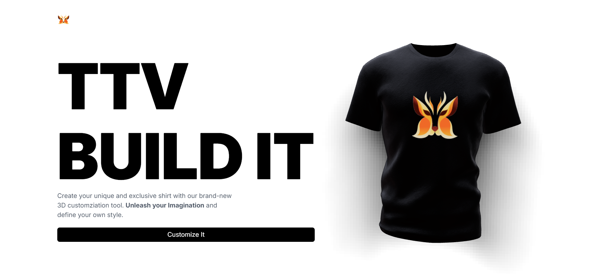
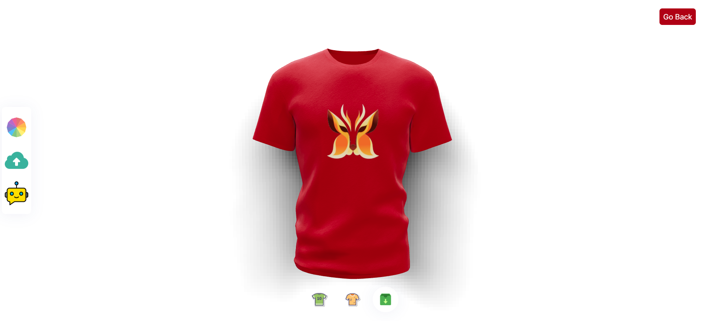

# Website Design Shirt 3D AI
# Introduction
- A Design T-Shirt Customizing Website
- You can upload custom logos and texture files.
- Or you can write AI Prompt to help you generate custom logos and textures for your T-shirt.

# Home Page

    

 

# Customizer Page

    

# Using

- Vercel: Hosting Services
- Tailwind CSS: Format Style
- NodeJS: Back-End
- React & ThreeJS: Front-End
- Git & Github: Version Control
- OpenAI: AI Support

[website]: https://ttv-fe-design-shirt-ai.vercel.app/
